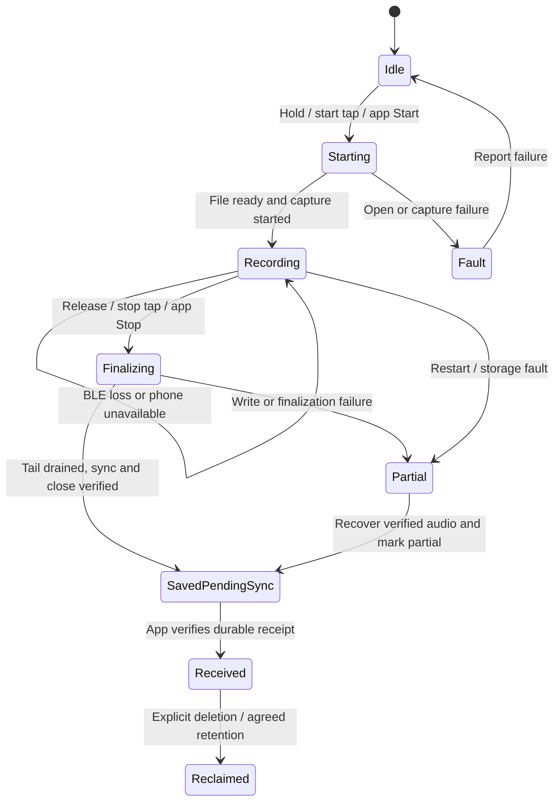

# Ring recording and push-to-talk requirements

Reviewed September 6, 2026 for **603V1.23.2**, standard **1.23.2**, factory
firmware **6.0.3.3Z62**. The Sudo Voice candidate uses this same board selection;
it does not select `1.23.2_one_sec`.

**The BLE transfer candidate does not complete push-to-talk or fix connected
recording's missing Flash file.** It improves sending files that already exist.
Hold/release behavior, recording persistence, completion acknowledgments and
recovery are release requirements below. None has passed physical acceptance
in this work. The separate recording-command correction described below fixes
a candidate regression; it does not implement this recording lifecycle.

## Requirements and current status

| ID | Required behavior | Source | Current evidence / gap |
| --- | --- | --- | --- |
| PTT-01 | Hold to begin recording; release stops the microphone and finalizes the clip. Works connected and standalone. | R1; R2 §1, §3.1; R3 B1 | Standard 1.23.2 has no active recorder start/stop in its hold branches. IQS release coordinates do not produce a release callback. The app's current gesture bridge handles double taps only. End-to-end PTT remains open. |
| PTT-02 | Keep double-tap start / double-tap stop as a separately selectable memo interaction, with the same reliable file lifecycle. Debounce gestures and honor Stop received while Start is pending. | R1 button mapping; R4 acceptance | App has a serialized double-tap workaround and tests for early Stop / ambiguous Start. Native connected recording still lacks Flash persistence. Exact gesture mapping remains a configurable product setting. |
| REC-01 | Save the complete recording locally from its start, including while connected; live audio may also stream to the app. | R4; R1 preservation policy | Standard target excludes the vendor online Flash open/write/close branches. No new file is created by that native path. |
| REC-02 | Start explicitly reports success/failure. Stop leads to a final result with recording identity, file name/ID, actual size, and completion or failure state. App can query authoritative recording state. | R4 questions 3–4 | `0x71/0x05` returns a one-byte Boolean. This is not a verified file-finalization receipt. `0x71/0xFD` discards the conversion result and sends no ACK; `0x71/0x0C` returns zero unconditionally on this target. |
| REC-03 | Stop capture, drain the encoder/capture tail, check writes and sync, then close and expose the finalized file. | R4 complete playback; Caption adaptation | Current Stop clears queued audio. Public recording writes discard storage errors and advance byte counts anyway. |
| REC-04 | BLE loss or app termination must preserve recording data; reconnect discovers saved or recoverable partial files. Reboot recovery must identify a verified prefix and an incomplete tail. | R4 question 5 | No established end-to-end recovery contract. The disconnect handler's online-to-offline call is commented out. LittleFS alone does not prove a complete recoverable audio file. |
| SYNC-01 | Sync stored audio after reconnect; delete only after confirmed app receipt. Preserve unsynced audio when full and report the failure. | R1; R2 §1; R3 B1.6 | Transfer errors now preserve files in the transfer path. Separate recording-space reclamation can still delete recordings without a verified phone copy. Retention conflict is resolved as the proposed preservation policy below. |
| UI-01 | Green LED throughout recording, independent of trigger, connection or app state. One reliable short start haptic; documented stop/error feedback. | R2 §3.2–3.3; R3 B2–B3 | Factory source has LED/color and two haptic-mode settings, but this is not the full requested on/off, strength/duration API or a demonstrated consistent state model. |
| UI-02 | App can configure supported LED behavior and haptic strength/duration within documented hardware limits; values apply in standalone mode. | R2 §3.2–3.3; R3 B2–B3 | Existing `0x8D/0x8E` scene/mode controls are partial. Full ranges, disabled behavior and persistence need implementation/verification. |
| TOUCH-01 | Reduce accidental swipes; provide sensitivity/gesture configuration and an option to disable optional gestures while keeping hold-to-talk. Document the interaction with the double-tap memo setting. | R1; R2 §3.4; R3 B4 | Compiling out media/HID actions does not prove that sensor gestures are disabled, sensitivity is fixed, or hold/release is correct. |
| LINK-01 | Stable connected use, complete error-code meanings, resumable file transfer and correct behavior when the phone stops consuming live audio. | R2 §3.5; R3 B5 | Queued sender and checked file reader have host tests; physical stability, goodput and combined recording/transfer behavior remain unmeasured. |
| HID-01 | Preserve the earlier question about long-press dictation to a keyboard host, including feasibility of app text → Ring → HID keyboard reports. | R3 B1.7; B4.16 | Open product/protocol exploration. Retaining a HID service does not implement text input. Do not call this requested use case removed or completed because unrelated media actions were stripped. |

Battery jumps, charging-time battery visibility, measured recording/standby
power, charging-case states, codec/API documentation, SDK errors and controlled
firmware releases also remain in the preserved June supplier list. The BLE
patch does not close those items. Transcription remains on the phone/service;
no Ring ASR engine is required.

## What the source actually establishes

Firmware evidence was reviewed at candidate `d0c0d62` before the small recording
command correction. App evidence is pinned to
[`ShopItalic/app` commit `60c37a3`](https://github.com/ShopItalic/app/tree/60c37a3dcfed32f80e7b615b57d089c1c9a8835b).
These are source observations, not a fresh read-back of the physical Ring.

### Hold and release on the selected touch driver

The target selects the IQS7211E touch controller. Its hold gesture reaches
`TOUCH_HOLD_EVENT`, which emits `BUTTON_LONG_PRESS`, posts `HOLD_START`, and
resets a **500-tick** timer. However, the active recorder code in
[`app_touch_button_handler.c`](../../firmware/bc_ros/bc_application/app_touch_button_handler.c),
lines 355–492 is gated to other board variants. **Standard 1.23.2's hold-start
and hold-stop branches do not start or stop the recorder.** This is inherited
from the supplier code; optional HID/media exclusions did not implement or
remove those recording transitions.

The sole `HOLD_STOP` producer is the timer callback at lines 141–151, rather
than a physical release edge. The
[`IQS7211E driver`](../../firmware/bc_ros/bc_device/touch_button/IQS7211E/IQS7211E.c)
recognizes release coordinates (`0xFFFF`) at lines 985–1000 but only changes the
interrupt interval. Its hold bit invokes a callback at lines 1049–1077; there
is no matching release callback. Wire a validated sensor release event through
the firmware state machine and the app protocol. The SDK's separate GPIO
`q_multi_button` release support is not this Ring's IQS touch path.

### Connected recording and command results

- [`app_pdm_handler.c`](../../firmware/bc_ros/bc_application/app_pdm_handler.c),
  `app_pdm_touch_start` around lines 1351–1374: online Flash open is conditional
  on `HANDWARE_1_23_3` or `HANDWARE_1_23_2_ONE_SEC`. The selected standard target
  defines neither. The online worker sends BLE at lines 659–680; simultaneous
  Flash write at lines 681–691 has the same gate. Offline recording uses the
  file writer at lines 646–655.
- [`app_cmd_handler.c`](../../firmware/bc_ros/bc_application/app_cmd_handler.c),
  `app_cmd_pdm`: subcommand `0x05` sends a Boolean for Start/Stop. It has no
  recording ID, final byte count, finalization state or failure category.
  Subcommand `0xFD` calls `app_pdm_switch_online_to_offline` without using its
  Boolean return or enqueueing a response. The `0x0C` status path is meaningful
  only under `HANDWARE_1_23_3`; it returns zero otherwise.
- [`app_ble_handler.c`](../../firmware/bc_ros/bc_application/app_ble_handler.c),
  lines 217–219: the standard target clears the touch key flag on disconnect;
  the conversion call is commented out. That clear handler stops online PDM
  (`app_touch_button_handler.c`, lines 676–681), without adding a local backup.
  On connection, lines 133–138 enqueue an internal offline Stop, so reconnect
  itself can terminate an offline recording. Both transitions need to respect
  the new recording owner and gesture state. Calling the internal `0xFD` command
  from the app would not by itself recover audio already streamed, add an ACK,
  guarantee a gapless transition, or establish restart recovery.
- [`app_pdm_handler.c`](../../firmware/bc_ros/bc_application/app_pdm_handler.c),
  `app_pdm_close` lines 413–421 clears the collection queue before PDM stops.
  `app_pdm_recording_stop` uses a fixed wait before file close. In
  [`app_ppg_file_data_handler.c`](../../firmware/bc_ros/bc_application/app_ppg_file_data_handler.c),
  `app_ppg_file_write` lines 2251–2259 ignores the internal write result, and
  `lk_ppg_space_reclamation` can delete files independently of app receipt.

### Current app workaround

The pasted Chinese message accurately identifies the firmware gap, but its
workaround description is older than the current app implementation.
[`RingStreamRecorder.swift`](https://github.com/ShopItalic/app/blob/60c37a3dcfed32f80e7b615b57d089c1c9a8835b/apps/ios/Sudo/Services/RingStreamRecorder.swift#L15)
now sends the SDK-generated five-byte live Stop packet directly with
`sendCustomCommand`, waits **150 ms**, then uses acknowledged
`ringStartRecording(true)`. One recording lease excludes competing SDK
commands. The second double tap calls `ringStartRecording(false)` and schedules
a file-list sync. Stop during Start is retained, and an ambiguous Start keeps
the next gesture as Stop instead of risking another Start.

This is still a timing-based conversion: the initial live Stop has no firmware
ACK, the first online-only audio is not thereby saved, and a Boolean Stop does
not prove the encoder tail and file contents are complete. The phone cannot
supply a missing hardware release event or guarantee execution while iOS has
terminated the app.

[`RingKeyEvent`](https://github.com/ShopItalic/app/blob/60c37a3dcfed32f80e7b615b57d089c1c9a8835b/apps/ios/Sudo/Services/RingProductionBoard.swift#L87)
defines long press and seven tap/swipe codes, with no release event.
`handleRingKeyEvent` handles `.doubleTap` only for this bridge. Existing
[`RingTransportTests`](https://github.com/ShopItalic/app/blob/60c37a3dcfed32f80e7b615b57d089c1c9a8835b/apps/ios/SudoTests/RingTransportTests.swift#L1530)
cover command ordering, stale charging presentation, early Stop and ambiguous
Start using mocks; they do not establish physical hold/release or file durability.

**Candidate/app compatibility is an open gate.** The bridge matches exactly
`6.0.3.3Z62`, while the engineering candidate advertises `6.0.3.3-SUDO1`.
The current app therefore will not automatically apply that workaround to the
candidate, even though the candidate still has the underlying recording gap.
Define and test capabilities or an explicit compatibility entry before any
candidate hardware acceptance. Do not simply remove the legacy workaround.

### Recording command regression found during this review

The inherited `app_package_mic_recording_start` and
`app_package_mic_capture_recording_start` constructed five bytes including
`data[0] = 1`, then overwrote their declared length with four. The candidate's
bounded parser copies only the declared bytes into a zeroed command. This
caused the Start payload to become zero, which the PDM handler interprets as
Stop. This review corrects the packet lengths and rejects truncated recording
commands. It restores the intended command meaning; it does not add PTT,
connected Flash backup, a release event, or durable finalization.

[Validation](../../firmware/recording-command-validation.json): 99 host checks
execute the actual source producers, bounded parser and PDM dispatch, with
queue/hardware effects intercepted, under ASan/UBSan. The pre-fix candidate
reproduces the Start-to-Stop regression; the corrected version and the existing
462 transfer checks pass. Both modified production C files compile as ARM
objects. This is not a production link or physical recording test.

## Reconcile the historical requirements

| Conflict | Treatment for the next implementation |
| --- | --- |
| June pre-read and agenda explicitly request **no local storage while connected**. The new Chinese request requires connected recordings to produce complete files. | The latest user request supersedes the June behavior. Prefer a local recording from the first captured frame, with optional simultaneous live BLE. An official acknowledged conversion is an acceptable supplier fallback only if the complete recording, including the transition, is preserved and the acceptance tests pass. |
| April says unsynced clips must never be overwritten and full storage blocks recording. June agenda B1.4 says delete oldest first; B1.6 still requires receipt before deletion. | Proposed resolution: preserve unsynced clips; reclaim only verified received files under a defined policy. Report full storage rather than silently delete pending audio. Retain the historical conflict for review; no automatic-deletion policy was changed in this patch. |
| April specifies white recording LED; June explicitly asks for green in every recording mode. | Use the later green-recording requirement. Document other colors separately; do not combine incompatible historical LED matrices. |
| April specifies a 10-second maximum clip, while later requests include double-tap memos and a 10-minute stability session. | Retain the 10-second PTT limit as a historical product decision to resolve per interaction. Do not silently impose it on all memo recordings. A 10-minute connection test is not proof of a 10-minute clip requirement. |
| April requests 16 kHz mono Opus; current source/app use the vendor ADPCM contract, interpreted by the app as 8 kHz mono. | Preserve compatibility for the recording reliability repair. Treat an Opus/rate change as separate work requiring measured device output and negotiated app decoding. C enum names alone do not establish actual sample rate. |
| Optional media/HID actions were removed, but June also explored keyboard dictation. | Preserve the dictation use case as open. A future keyboard mode needs a specified text/host contract and separate validation; it must not re-enable accidental media or swipe actions. |

## Proposed shared recording lifecycle

Both hold/release and double-tap start/stop should feed one firmware-owned
recording state machine. BLE connection and phone readiness affect live
delivery, not whether the recording has a local owner. This is a design target,
not the current implementation.

For BLE loss/app termination, the proposed default is to keep local capture
under the original gesture: release ends a PTT clip and a second tap ends a
memo. Firmware must own those transitions. A reboot recovers the prior file;
it must not resume the microphone automatically. An abrupt power loss cannot
run a graceful close, so define and test the maximum tail loss from the last
verified checkpoint and mark recovered partial clips explicitly.

1. Create the recording identity and storage destination before reporting
   recording success. Give green LED / one start haptic on the accepted state
   transition, including standalone operation. A failed start needs distinct
   feedback and must not look like a successful recording.
2. Send complete encoded frames to a bounded recording worker. Check local
   acceptance before optional live delivery; Bluetooth congestion must not
   block capture indefinitely or silently drop the only copy.
3. On Stop, stop production, drain queued capture/encoder output, validate
   writes, sync and close. Do not clear the queue as a substitute for draining.
   If release arrives during Start, remember it or explicitly cancel Start;
   never leave the microphone running because the event arrived early.
4. Publish the final file identity, actual size and status. If a recording
   rolls across multiple files, return a session manifest or ordered segment
   references so the app can verify the complete memo.
5. Reuse Caption's state separation, stop barrier, bounded recovery scanner,
   checkpoint fault cases and session rejoin concepts. Implement them with
   Ring-sized buffers and LittleFS. Preserve legacy raw ADPCM exports and
   logical resume offsets unless a new format is explicitly negotiated.

### Protocol and SDK deliverables

The names below describe required semantics. **They are not assigned wire
opcodes or existing BCL SDK APIs.** Add a version/capability exchange and update
the app adapter together; document exact byte layouts and result codes.

| Operation / event | Required meaning |
| --- | --- |
| Capabilities / device identity | Board, build, protocol version, supported gestures, native Flash recording, explicit release/finalization events, supported audio/file format. |
| Start result | Request ID, recording/session ID, accepted or failed state and specific reason. Repeating the same request must not open another file. |
| Hold released / recording stopping | Explicit firmware event tied to the recording. Silence or missing BLE packets is not a release or durable-completion ACK. |
| Stop result / finalization event | Request and recording IDs, finalized / partial / failed, file name/ID or segment manifest, actual saved bytes, format and integrity metadata. A pending Stop must be distinguished from final completion. |
| State query / reconnect snapshot | Idle / starting / recording / finalizing / saved / partial / failed, current identity, saved progress and pending files. Resolve lost ACKs without blindly toggling Start/Stop again. |
| Durable receipt / deletion | App verifies complete bytes and playable decode and commits the file to persistent storage, then confirms that recording identity. BLE notification success, live-flow ACK and transcription completion are separate concepts. Deletion remains separately acknowledged. |
| Configuration / errors | Supported gesture mappings, sensitivity, indicator options, haptic ranges, read-back/persistence behavior and explicit unsupported/full/busy/write/sync/timeout errors. |

An approximately one-second absence of audio was an old fallback for detecting
release. It cannot distinguish a released finger from radio loss or a suspended
app. Prefer an explicit event and authoritative state query; retain fallback
behavior only as documented compatibility handling.

## Acceptance matrix

All device rows remain **pending**. Record board/read-back, build hash, app
commit, gesture configuration, initial file list, timing logs and resulting
audio for each run. Tests must exercise the standard board selection.

| Test | Required result |
| --- | --- |
| Connected double tap | Keep BLE connected; double tap, speak, double tap. A new nonzero finalized file appears and the app fully downloads and plays the beginning and end. This is R4's required acceptance. |
| Connected PTT | Hold, speak, release. One start pulse, green during recording, mic stops on release, explicit state progression and a complete local file. Demonstrate the June release/stream-stop bound of one second and record the actual timing. |
| Standalone PTT and memo | Same gestures and feedback without the phone; reconnect discovers and plays the saved recording. |
| Very short / rapid gestures | Release or second tap during Start, duplicate events, taps during finalization and repeated commands never create phantom sessions or leave capture running. Report an empty/cancelled clip honestly. |
| App background / termination | Recording, release/stop and local finalization do not require app execution. On next permitted connection the app queries state and retrieves the file. |
| BLE loss / stalled phone | Disconnect or stop consuming live audio during capture; the local recording remains valid. Rejoin does not append to the wrong session or erase an unsynced clip. |
| Restart / abrupt power interruption | Exercise file-open, frame-write, checkpoint and finalization boundaries on a verified spare device. Recover only valid audio, label partial files, preserve originals and measure possible tail loss. |
| Storage full / write / sync / close failure | No silent success, fabricated byte count or deletion of pending recordings. Existing files remain available; start/stop reports a specific failure. |
| Stop tail / rollover | Inject a known audio tail and delayed worker; all accepted frames appear exactly once in the finalized recording or ordered segments. |
| ACK loss / retry / reconnect | Retrying Start/Stop and querying status converge on the same recording. Duplicate delivery and receipt do not create/delete unrelated files. |
| Transfer integrity / interruption | Verify expected file bytes, playable decode, cancellation and supported resume with the current app. Retain the Ring file until durable receipt. |
| Gesture / indicator configuration | Settings survive reconnect/reboot; disabling optional swipes retains configured PTT. Green/start haptic remain consistent across trigger sources and app states. Confirm the documented controllable ranges. |
| Sustained connected use | Stable connection through a 10-minute session of permitted clips, including recording and transfers; log radio goodput, errors, memory/stack use and power separately. |
| Compatibility / update | Test legacy factory firmware and the new candidate with their correct app capability paths. Supplier reviews the linked image, signing/update package and board-specific recovery procedure. |

## Evidence retained in this repository

The three historical documents are exact byte copies. Their original Drive
locators, sizes and SHA-256 hashes are in the
[requirements source manifest](sudo-ring/requirements/sources.json). They retain
historical names and contradictory requests deliberately; this review records
which requirements supersede them.

- **R1:** [April 13 master feature spec](sudo-ring/requirements/master-feature-spec-2026-04-13.md).
- **R2:** [June 13 supplier pre-read](sudo-ring/requirements/supplier-pre-read-2026-06-13.md).
- **R3:** [June 13 call agenda and change requests](sudo-ring/requirements/supplier-call-agenda-2026-06-13.md).
- **R4:** [User-supplied Chinese connected-recording request](sudo-ring/requirements/connected-recording-request-2026-09-06.zh.md).

The [candidate reference](ring-firmware-candidate.md) records completed BLE work
and its validation limits. The [backlog](../backlog.md) tracks implementation
and device acceptance. This review does not send a message to the supplier or
change installed firmware.
