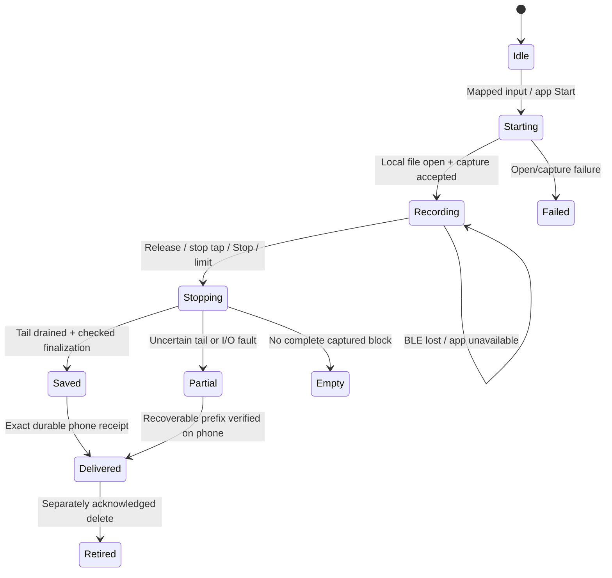

# Ring recording and push-to-talk requirements

Reviewed September 7, 2026 for **603V1.23.2**, standard **1.23.2**. Factory
artifact version is **6.0.3.3Z62**; the engineering candidate identifies itself
as **6.0.3.3S04** (unpublished source candidate). The published S03 RC1 remains unchanged. It does not select `1.23.2_one_sec`.

The candidate now implements a firmware-owned recording lifecycle, complete
local capture while connected, three mappable physical inputs (hold, double tap and triple tap). Client adapters belong in `ShopItalic/app`; S04 client adoption is outside this
firmware-only change. These are source changes
with host fault tests and target build checks, not changes to the user's ring.
Physical acceptance remains pending. See the [candidate](ring-firmware-candidate.md)
for current build evidence and the [wire contract](ring-voice-protocol.md) for
exact packets, errors and compatibility gates.

## Requirements and implementation

| ID | Requirement and source | Candidate implementation | Remaining acceptance |
| --- | --- | --- | --- |
| PTT-01 | Hold starts; release stops and finalizes, connected or standalone. R1, R2 §1/§3.1, R3 B1. | IQS7211E validated contact/release reports feed one gesture owner. Release during Start is retained. An independent capture guard stops on stale touch (750 ms lease), invalid report, even while the recording worker is occupied. | Measure actual sensor/IRQ/PDM timing and the requested one-second release bound. |
| PTT-02 | Three mappable inputs and adjustable hold activation. September 7 user decision. | Hold, double tap and triple tap each map to disabled, memo toggle or SDK/app event; hold additionally maps to PTT. Double tap is off by default. Hold activation 500–10,000 ms persists and requires sensor readback. | Verify recognition/threshold timing on the fitted sensor and ensure triple tap does not also emit double tap. |
| REC-01 | Complete local audio from the start while connected; optional live stream. R4, R1. | File identity/open precede capture success. Each complete ADPCM block is accepted locally before optional live delivery. BLE readiness affects preview only. | Connected triple tap must produce a new nonzero file with audible beginning and end. |
| REC-02 | Explicit Start, Stop, state and final metadata. R4. | Versioned request IDs, persistent recording IDs, idempotent commands, state revisions, result codes, final name/size/frame count/CRC and complete/partial flags. Stop waits for finalization; lost replies can be resolved by querying state. | Validate the BCL notification forwarding hook on the physical phone/ring pair. |
| REC-03 | Stop production, drain accepted capture tail, then sync/close. R4, Caption adaptation. | Session-tagged PDM buffers and a drain barrier replace queue clearing. Write/checkpoint/close failures propagate; uncertain audio becomes partial. Empty capture is reported as empty. | Measure encoder and Flash latency; inject physical disconnects during finalization. |
| REC-04 | Disconnect/app death preserves capture; restart recovers a verified prefix. R4 §5. | Phone lifecycle never owns the microphone. A real LittleFS store uses checked metadata, checkpoints and completion markers. Cold mount recovers valid frames without restarting capture or formatting the volume. | Physical abrupt-power tests must establish the actual tail-loss envelope. |
| SYNC-01 | Resume and delete only after durable phone receipt; never overwrite unsynced audio. R1, R2, R3 B1.6. | Separate stream ACK, durable raw download verification, phone WAV/SHA validation, exact custody receipt and deletion. Resume binds ID/size/CRC/token/offset. Full storage rejects capture instead of reclaiming pending files. | Validate raw ADPCM decoding and interrupted app storage on device. Old factory root files remain read-only under the candidate until custody migration is defined. |
| UI-01 | Green while recording; consistent start/stop/error haptics. R2 §3.2–3.3, R3 B2–B3. | Recording owns the LED. Connection/custom LED events cannot override it. Default finite PWM pulses are 120 ms start, 280 ms successful stop, 400 ms error, with user-configurable strength/start/stop duration. | Measure visible behavior and physical motor response; PWM active time is not measured mechanical vibration time. |
| UI-02 | Standalone persisted LED/haptic settings and truthful readback. R2, R3. | SETTINGS and TUNING use checksummed LittleFS attributes with exact readback before success. App keeps confirmed values separate from edits. LED/haptic enable, strength and durations persist. | Power-cycle and read back every boundary setting on a spare unit. |
| TOUCH-01 | Reduce swipes, configure thresholds and optional gestures. R1, R2 §3.4, R3 B4. | Sensor mask admits only mapped hold, double tap and triple tap. Desired thresholds persist; I2C writes occur in a valid no-contact communication window and require register readback. Pending/applied/error is explicit. | Establish comfortable thresholds and verify release/no-contact semantics on the fitted IQS revision. |
| LINK-01 | Bounded live/file flow, resume, errors and stable connected use. R2 §3.5, R3 B5. | One BLE writer, bounded retry/deadline, epochs, fragment CRC, Ready lease, live/file windows, offset validation and checked cancellation. Local storage survives preview failure. | Measure goodput, MTU/PHY/window behavior, weak signal, ten-minute mixed use and iOS suspension. |
| POWER-01 | Stable, truthful battery and charging reporting. R2/R3 power list. | Checked ADC open/read/close and a single-flight status/measurement transaction. Trimmed filter resets across charging phases; invalid readings are UNKNOWN, not empty battery. Existing voltage table/cutoff and charging values remain. | Calibrate actual cells, charge/full states, thermal behavior and recording/standby current. |
| HID-01 | Long press for voice-to-text input in keyboard mode. R3 B1.7; phone ASR in R2 §1. | Provisional same-iPhone host: Ring hold/release and live audio feed phone ASR within a finite background window. Complete finals carry session/admission time; the visible Sudo keyboard checks document, presentation, edits, age and duplicates before insertion. | Physical BLE wake, model execution and keyboard insertion in another app; UIKit may deny or end the window. Force-quit/expiry retains Ring audio for sync instead of promising immediate text. Mac forwarding is not implemented. |
| HID-02 | Related supplier feasibility question: accept UTF-8 over BLE and emit HID keyboard reports. R3 B1.7/B4.16. | No UTF-8-to-HID command is implemented. Existing app transcript → shared store → iPhone keyboard-extension insertion is a different path. | Define host, keyboard layout, Unicode and acknowledgement behavior if this route is selected. The exploratory transport question does not remove the HID-01 product requirement. |

The implemented recording, storage, transfer, gesture and feedback paths are
exercised with production logic in host tests; hardware-facing tests replace
the peripheral/RTOS boundary. The wire/ADPCM
adapter and preview also have client tests. This establishes deterministic
software behavior under the modeled failures, not physical qualification.

## Decisions and historical conflicts

| Earlier requests | Current interpretation |
| --- | --- |
| June describes online-only PTT; R4 requires connected recordings to appear in Flash. | R4 and the latest reliability request supersede online-only storage: all new recordings have local backup from their first captured block. Live preview is optional. |
| April forbids overwriting unsynced clips; one June agenda item says delete oldest. | Preserve unsynced audio. Deletion requires exact durable custody and remains a separate acknowledged operation. No automatic oldest-file reclamation. |
| April asks for white recording LED; June asks for green in every mode. | Use the later green requirement, with persisted LED enable/disable. |
| April specifies a ten-second clip; later requests include memos and a ten-minute stability test. | September 7 user decision supersedes the old cap: S04 PTT runs until release. Saved S01–S03 limits load as zero; nonzero PTT settings or START requests are rejected. Memo/app recording retains its separate optional limit. |
| April requests 16 kHz mono Opus; current firmware and app use vendor ADPCM. | Preserve 220 encoded bytes → 440 PCM16 samples, interpreted as 8 kHz mono. An Opus/rate change requires measured codec, CPU/RAM/power and negotiated app support. |
| Optional media/HID actions are unwanted; June requests keyboard dictation and explores a Ring HID transport. | Keep media/swipe side effects disabled. Implement long-press dictation through the existing same-iPhone keyboard with bounded background execution. Ring UTF-8-to-HID/Mac forwarding remains a separate feasibility question. |

The September 7 decision specifies exactly three mappable physical inputs. A
fresh Ring maps a one-second hold to PTT and triple tap to memo toggle; double
tap is disabled. The existing same-iPhone
keyboard remains the provisional text-input host; Mac or arbitrary UTF-8-to-HID
input requires a separate host, layout, Unicode and acknowledgement contract.

## Recording lifecycle and durability

`bc_recording.c` owns transitions; `app_sudo_voice.c` is the only mounted
recording/filesystem worker; `app_sudo_capture.c` owns session-tagged PDM/encoder
buffers. No factory online-to-offline timing conversion is involved in candidate
recording. Reconnect cannot terminate a recording; a reboot never restarts the
microphone automatically.

The selected configuration checkpoints every **1,000 ms or 4,096 accepted raw
bytes**, whichever is reached first, and uses a **500 ms stop-drain timeout**.
These are worker scheduling targets, not guaranteed Flash completion times.
Abrupt power loss can discard an uncheckpointed tail; a failed sync can increase
that loss. Recovery reports verified audio and a partial flag rather than a
fabricated complete file. The current LittleFS cold-cut harness exercises **147
cuts** during recording, receipt and deletion with fresh mounts and no graceful
unmount. It verifies prefixes and preservation of earlier identities.

Native storage keeps full 64-bit identities, checksummed metadata, raw ADPCM, checkpoint byte/frame counts and CRC, completion information and durable receipt/tombstone
state. App export remains raw vendor ADPCM. Catalog reads metadata; file resume
first verifies the stored content in bounded scan steps. This avoids loading a
whole memo into RAM. A full file download starting at offset zero proves raw
CRC; a resumed suffix alone cannot authorize deletion.

The optional phone preview requires a verified account, exact candidate version
and capabilities, valid connection epoch and exclusive transport/decoder
leases. Memo/app preview runs in the foreground; PTT can request a finite
background assertion capped by the app at 25 seconds, with earlier UIKit denial
or expiration handled. This permits short dictation into the existing iPhone
keyboard when iOS grants execution. Native partials remain app display only;
the keyboard admits a complete final only into its still-visible, unchanged
document. A gap, stale token, stalled ASR or partial result falls
back to stored-file sync. READY confirmation is distinct from first decoded
PCM, stream ACK is distinct from durable custody, and preview does not create a
second canonical memo. The 25-second cap is not a system guarantee; see Apple's
[background execution model](https://developer.apple.com/documentation/uikit/extending-your-app-s-background-execution-time).
Denial, expiration and force-quit leave Ring capture and local audio intact;
checkpoint/resume handles the next permitted connection or execution opportunity.

## Configuration contract

The three physical inputs are press-and-hold, double tap and triple tap. Each
can be disabled, toggle a memo, or emit an SDK/app event. Hold can additionally
start PTT until release. Fresh defaults are hold after **1 second → PTT**,
**double tap → disabled**, **triple tap → memo toggle**. The firmware accepts
**0.5, 1, 2, 3, 5 or 10 seconds**, or another supported millisecond value.
The sensor uses hold register 0x4F in milliseconds; changes apply only in a valid
no-contact window and are read back before reporting applied.

Inputs persist independently from lights/haptics. Older SVS1 memo-enable choices
seed triple tap on/off when no new mapping record exists. S04 requires zero PTT
limit and rejects any attempt to set a nonzero value. There is no artificial PTT
time cap; storage exhaustion, power loss and capture/touch faults still end
capture. Memo/app recording retains its independent optional limit.

HELLO bits 9, 10 and 11 advertise triple tap, PTT until release and input
mappings. A host integrating S04 must require exact identity plus these bits
and preserve older firmware behavior. SDK/app actions emit connection-scoped live events;
unsent events expire and never replay after reconnect. Hold activation is
followed by release/cancellation, while a tap produces one activation.

Since S02, light/haptic switches cover normal application output after settings
load; S01 RC1 covers recording feedback only. Settings changes require an idle
Ring. SETTINGS persists the enable switches; TUNING separately persists
haptic strength and start/stop duration with readback. Tuning defaults are touch set/clear **54/52**, strength **100%**, start
**120 ms** and stop **280 ms**.

Supported touch set is **32–80**; clear is **30 through set−2**. These are sensor
threshold register values, not measured touch-force units. Haptic strength is
**1–100% of the retained safe PWM range** (the supplier waveform's 68% maximum
duty); start/stop active time is **20–400 ms in 20 ms steps**. Setup delay and a
quiet PWM tail are separate. Failed hardware setup returns failure for the
legacy pulse command; recording state continues to report storage truth even
if feedback hardware fails.

Persisted desired touch settings can be `pending`, `applied` after write/readback,
or `I/O error`. They are applied only in the sensor's no-contact communication
window and are re-applied after sensor reset. A success response confirms the
persisted desired settings; it does not falsely claim the sensor has already
accepted them. The client exposes this distinction. Unsafe manufacturing,
reset and legacy configuration controls cannot race an active capture owner.

## Factory diagnosis retained

The user's Chinese message correctly diagnoses the **factory** standard target:
`app_pdm_touch_start()` selects `PDM_MODE_ONLINE`, and its Flash open/write/close
branches are compiled only for `HANDWARE_1_23_3` or
`HANDWARE_1_23_2_ONE_SEC`. Standard 1.23.2 defines neither. Offline
`app_pdm_recording_start()` creates a LittleFS recording. Factory hold-start/stop
branches do not activate this standard board's recorder; IQS release coordinates
were not forwarded as a release event. Stop cleared queued capture audio, and
some recording writes ignored errors.

At app baseline
[`60c37a3`](https://github.com/ShopItalic/app/tree/60c37a3dcfed32f80e7b615b57d089c1c9a8835b),
the factory double-tap workaround sends a live Stop, waits 150 ms, then issues
`ringStartRecording(true)`. It serializes commands and retains early Stop, but
cannot recover an already-streamed prefix or make the unacknowledged live Stop
a durable file receipt. The matching app keeps that path for **6.0.3.3Z62**;
**6.0.3.3S01 plus HELLO capabilities** uses the native protocol.

The malformed internal five-byte Starts declaring length four were also fixed;
99 actual producer/parser/dispatcher checks retain that regression coverage.
Factory artifacts and the imported source baseline remain unchanged. Neither
factory artifact identity nor candidate source proves what is currently flashed
on the user's ring.

## Physical acceptance matrix

Every row below remains pending on a verified spare **standard 603V1.23.2**.
Record board/firmware readback, image hash, app commit, configuration, starting
file list, timing logs and resulting audio. Do not substitute a `one_sec` board.

| Test | Required result |
| --- | --- |
| Connected triple tap | BLE stays connected; triple tap, speak, triple tap. A new nonzero complete file appears, downloads and plays beginning and end. This is R4's central acceptance. |
| Connected and standalone PTT | Hold, speak, release. Correct green/start/stop feedback, explicit state and complete local file. Measure release-to-microphone-stop within one second. |
| Very short and rapid gestures | Release/second tap during Start, duplicate reports and taps during finalization never leave capture running or invent a saved clip. Empty audio is explicit. |
| App death and BLE loss | Local gestures and finalization continue; reconnect lists and retrieves the correct identity. No accidental restart or stop on reconnect. |
| Abrupt power | Cut power across open/write/checkpoint/finalize/receipt/delete boundaries. Recover verified prefixes, mark partial and retain unrelated recordings. Measure tail loss. |
| Full storage and I/O errors | Existing pending audio is preserved. Open/write/sync/close failures never report false success or advance verified bytes. |
| Tail and sustained memo | Known audio tail appears exactly once. Long memo remains one identified file until Stop/limit/fault; automatic rollover is not needed by the current contract. |
| Retry and resume | Lost Start/Stop ACKs converge on one recording. Interrupted transfers resume at verified aligned offsets; stale callbacks/cancellation cannot act on a new epoch. |
| Custody and deletion | Complete raw CRC, playable WAV and durable app identity/integrity checks precede receipt and delete; failed phone storage leaves the Ring copy. |
| Settings and feedback | Boundary values persist through power cycle; pending sensor settings become verified only after actual readback; no unwanted swipe/media behavior. |
| Power and charging | Calibrate percentage and unknown handling, charge/full presentation, battery current, temperature and case interaction with real cells. |
| Ten-minute mixed use | Record/stop/sync permitted clips under weak signal and foreground/background changes; record goodput, memory/stack, errors and current draw. |
| Same-iPhone keyboard dictation | With the Sudo keyboard visible in another app, hold/speak/release and insert the complete final once into that document. Changed fields, manual edits, reopened keyboard and stale finals reject insertion. Exercise background denial/expiration, force-quit and missing models; Ring audio stays recoverable. |
| Update and recovery | Supplier reconciles the baseline/compiler, reviews GNU ABI/map, assigns/signs a release and demonstrates interrupted-update recovery before any user-ring update. |

## Evidence retained in this repository

The three historical documents are exact byte copies. Their original Drive
locators, sizes and SHA-256 hashes are in the
[requirements source manifest](sudo-ring/requirements/sources.json). They retain
historical names and contradictory requests deliberately; this review records
which requirements supersede them.

- **R1:** [April 13 master feature spec](sudo-ring/requirements/master-feature-spec-2026-04-13.md).
- **R2:** [June 13 supplier pre-read](sudo-ring/requirements/supplier-pre-read-2026-06-13.md).
- **R3:** [June 13 call agenda and change requests](sudo-ring/requirements/supplier-call-agenda-2026-06-13.md).
- **R4:** [User-supplied Chinese connected-recording request](sudo-ring/requirements/connected-recording-request-2026-09-06.zh.md).

The [candidate reference](ring-firmware-candidate.md) records the implementation, reproduction commands
and validation limits. The [backlog](../backlog.md) tracks remaining integration
and device acceptance. This review does not send a message to the supplier or
change installed firmware.

### S02 hold-to-stop escape

When an enabled double-tap recording is active, a hold requests Stop through
the same drain-and-finalize path as a second double tap. Repeated hold reports
and release cannot start another clip; a new hold after release can start PTT.
This does not interrupt an app-owned recording. It provides another gesture
when a double tap is missed, but still needs a functioning touch sensor.
Supplier testing must reproduce the reported stuck double-tap behavior on
physical hardware; passing host tests does not establish its original cause.

In S04, this escape applies only when hold is mapped to PTT and the active
recording is a memo. Mapping hold to another action does not add an implicit
stop action. Any input mapped to memo toggle can stop that memo.
