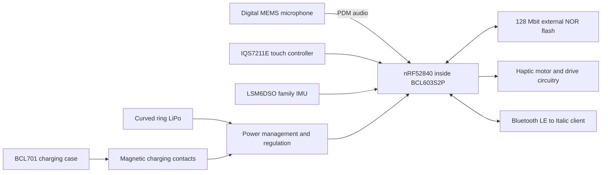

# Italic Ring (formerly Sudo Ring) component stack and bill of materials

Extracted on **2026-09-05** from the factory BOM workbooks, Bravechip
datasheets, mechanical records, and application/firmware sources.

The public-facing product name is **Italic Ring**. Historical Sudo names remain
in source filenames, paths, and technical IDs so the original evidence and
recorded hashes can be checked.

The best-supported hardware baseline is the **Fitwatch / Feiyang ring using
Bravechip BCL603M3 hardware 1.23.2**, with a BCL603S2P SiP containing Nordic's
nRF52840. The latest mechanical reference inspected specifies **sizes 10, 11,
and 12**, Grepow curved batteries, a `0518` motor, and a ceramic exterior.
These records describe the design and quoted assemblies; they do not establish
the exact fitted parts in every manufactured ring.

This is an extracted engineering BOM, not a factory-released purchasing BOM.
The sources do not provide a complete reference-designator list, approved
alternates, every passive value, or an approved battery specification for each
size. Unresolved part identities and changes are retained below rather than
filled with generic substitutes.

## How to use this reference

- [Component stack](#component-stack): what is inside the ring and how it connects.
- [Electronic BOM](#electronic-bom): named devices and assembly boundaries.
- [Mechanical stack and size variants](#mechanical-stack-and-size-variants):
  materials, batteries, motors, and measured envelopes.
- [Charging case](#charging-case): separate companion hardware.
- [Electrical and storage specifications](#electrical-and-storage-specifications):
  manufacturer conditions and limits.
- [Factory firmware evidence](#factory-firmware-evidence): board selection and
  the interfaces corroborated by the supplied source archive.
- [Supplier cost BOM](#supplier-cost-bom): original rows, changes, and arithmetic.
- [Revision differences](#revision-differences): earlier proposals and unresolved conflicts.
- [Open specifications](#open-specifications): what is still needed for purchasing or build release.
- [Source register](#source-register): exact files, revisions, and evidence locations.

The accompanying [component CSV](sudo-ring/bom.csv),
[supplier cost CSV](sudo-ring/quoted-bom.csv), and
[source manifest](sudo-ring/sources.json) support filtering and re-extraction.
[Workbook extracts](sudo-ring/source-extracts.json) retain the selected original
cells, number formats, formulas, and cached values behind the commercial tables.
Blank prices or quantities mean **not specified**, not zero.

The component CSV has 37 records covering assemblies, component breakdowns,
size alternatives and unresolved groups; it does not mean 37 fitted parts.
`RING`, `KIT` and `HISTORICAL` are grouping roots in `parent_id`. Choose one
`BAT10` / `BAT11` / `BAT12` variant for a ring, and preserve the included-in-parent
cost treatment when summing anything. The manifest records these conventions.

Evidence labels used here:

| Label | Meaning |
| --- | --- |
| Specified | A manufacturer datasheet or factory document names the component or property. |
| Quoted | A supplier cost/quotation workbook lists it; this is not proof of assembly or purchase. |
| CAD | A supplier model or its recorded geometry inspection contains the component or dimension. |
| Source | Application or vendor firmware code selects or uses it; this is not a device read-back. |
| Historical | An earlier vendor/design proposal, retained to explain a difference. |
| Inferred | A useful interpretation that still needs confirmation. |
| Unspecified | The inspected sources do not establish it. |

## Component stack

The ring combines a ceramic enclosure, an inner liner, a curved flexible
electronic assembly, a size-dependent curved LiPo cell, a haptic actuator,
and magnetic charging contacts. The FPC carries the processing, touch, audio,
motion, and recording-storage electronics. Battery and motor placement use
different regions around the circumference and beneath the raised dome; this
is not a uniform sandwich of identical thickness around the whole ring.

The arrows describe subsystem relationships. They are not a released schematic
or a claim that every device is wired directly to the MCU without supporting
components. The ring's charging contacts belong to the ring assembly; the
`BCL701` module belongs to the external charging case.

### Names that refer to different assembly levels

| Name | What it identifies | Evidence |
| --- | --- | --- |
| Italic Ring (formerly Sudo Ring) | Finished product, including size-specific enclosure, electronics, battery, and haptics. | Product and mechanical records. |
| `BCL603M3 1.23.2` | Bravechip's functional ring module/design family in the May 2026 datasheet title. | D1, p. 1. |
| `BCL603MHV1.23.2` | Flexible PCBA/module material number; 52 × 6.5 mm. CAD labels replace punctuation with underscores. | D1, pp. 1, 7; M1. |
| `603V1.23.2` | Production hardware identity accepted by the iOS app. | SW1, `supportedHardwareVersion`. |
| `BCL603S2P` | SiP mounted within the module; also used as the firmware-package prefix. | D1, p. 4; D3; SW1. |
| `nRF52840` | Nordic MCU/radio inside the SiP, not an additional second processor. | D1, p. 4; D3. |
| `BCL701MHV1.29.2` | Charging-case PCBA, a different assembly from the ring PCBA. | D2, pp. 1, 5, 6. |

**Avoid double counting:** a quoted PCBA includes its fitted SiP, microphone,
touch controller, IMU, flash, and support components unless the supplier says
otherwise. The nRF52840 and SiP-internal power/clock components are a breakdown
of `BCL603S2P`, not extra top-level purchases. The motor is described in the
module datasheet but also appears as a separately assembled mechanical part.

## Electronic BOM

Quantities in this table are functional quantities per ring/module inferred
from the singular component listing, unless a factory cost row establishes the
quantity. They are not reference-designator quantities from a released PCB
BOM. Full manufacturer ordering codes are shown only where established.

| ID | Component / role | Manufacturer and identifier | Quantity / parent | Specification and evidence |
| --- | --- | --- | --- | --- |
| R01 | Flexible ring PCBA | Bravechip `BCL603MHV1.23.2`, module family `BCL603M3` | 1 assembly / ring | 52 × 6.5 mm, double-sided component placement, four-layer FPC, reinforcement at key locations; touch area 18.5 × 5.9 mm. D1, pp. 1, 7. |
| R02 | Processor/radio SiP | Bravechip `BCL603S2P` | 1 / R01 | Integrates nRF52840, LDO, PMIC, crystal oscillator, and key resistors/capacitors; manufacturer says more than 20 integrated devices. LGA34, 4 × 6.8 mm; exposed ground pad is separately numbered 35 in the pin table. D1, p. 4; D3, pp. 1, 5–7. |
| R03 | MCU and Bluetooth radio | Nordic Semiconductor `nRF52840` | Inside R02 | 64 MHz Arm Cortex-M4 with FPU, 1 MB on-chip flash, 256 KB RAM, 2.4 GHz radio. Do not price as a second fitted MCU. D1, p. 4; E1. |
| R04 | Capacitive touch/proximity controller | Azoteq `IQS7211E` | 1 / R01 | Capacitive trackpad/touch controller with I²C and interrupt/ready signaling. Exact package/ordering suffix is not stated by D1. A touch press does not prove a separate force sensor. D1, p. 4; E2. |
| R05 | Digital MEMS microphone | STMicroelectronics `MP23DB01HP`; manufacturer order code `MP23DB01HPTR` | 1 / R01 | PDM, bottom acoustic port; RHLGA 5-lead, 3.5 × 2.65 × 0.98 mm. Factory PDF prints `MP23DB01HP RHLGA-5`. Procurement suffix requires fitted-part confirmation. D1, p. 4; E3. |
| R06 | Motion sensor | STMicroelectronics LSM6DSO family; factory prints `LSM6DSOW LGA-14P` | 1 / R01 | Six-axis accelerometer plus gyroscope. Preserve the factory's `W` suffix; the public LSM6DSO page corroborates the family, not the exact fitted order code. D1, p. 4; E4. |
| R07 | External recording flash | GigaDevice `GD25WQ128HQIGR` | 1 / R01 | 128 Mbit SPI NOR, equivalent to 16 MiB raw capacity. The factory PDF and `1.23.2` firmware selection agree on the exact code. Firmware table specifies 256-byte pages and 4 KiB erase sectors; manufacturer family supports single/dual/quad SPI. Do not substitute GD25Q128H/GD25WQ128E silently. D1, p. 4; E5; SW2. |
| R08 | Haptic actuator | Factory module lists `LBM0518A4107F`; later CAD names `BREP_0518` | 1 / ring | `0518` is the active mechanical baseline. The datasheet calls the actuator linear; firmware uses PWM control. Manufacturer, rated drive, driver topology, and equivalence between the order code and CAD envelope remain unconfirmed. D1, pp. 4–5; M1–M3; SW2. |
| R09 | Ring cell | Grepow `GRE170722_10`, `GRE170724`, or `GRE170726` | 1 selected variant / ring | Curved LiPo; size-specific IDs come from the June 17 CAD, not the May module datasheet. Electrical ratings are still missing for these exact cells. M1–M3. |
| R10 | Power management, regulation, clock and SiP support | Firmware selects `YHM2712` PMIC driver; D3 specifies SiP-integrated PMIC, LDO, crystal and passives | Included functions; physical allocation unconfirmed | SW2 selects PMIC type 2 and checks ID `0xA0`, using functions named `YHM2710_*`. Exact orderable PMIC, package and SiP/board boundary require the schematic. D3 does not give an internal manufacturing BOM. Do not count a separate YHM device in addition to the integrated PMIC without that evidence. |
| R11 | Additional board support and motor drive | MPNs / quantities unspecified | R01 | A full schematic is needed for motor switching/drive, external resistors/capacitors/inductors, ESD, protection, and power sensing. Software controls alone do not identify fitted parts. |
| R12 | RF antenna and matching | Exact design / part identifiers unspecified | Ring RF path | The SiP exposes an ANT connection. Antenna topology, matching values, and tuning through the final shell are not established by the module PDF. D3, p. 6. |
| R13 | Ring indicators / optical parts | Exact LED MPN, count, light guide, and optical seal unspecified | Ring assembly | Earlier PRDs specify LED behaviors; retain those as requirements until matched to the current factory assembly. |

The [CSV](sudo-ring/bom.csv) includes mechanical and case items as well as these
electronics, with explicit hierarchy and evidence status.

### Capability is not a fitted component

The SiP's generic datasheet advertises support for NFC, PPG, NTC, ECG, and other
peripherals. That is not evidence of an NFC antenna, optical heart-rate sensor,
blood-oxygen sensor, ECG electrode, or discrete skin-temperature sensor in
Italic Ring. Likewise, Nordic's generic USB/multiprotocol capability does not
establish a USB data port, Thread, Zigbee, or Bluetooth Classic audio profile
on this ring. D1's named sensing stack is microphone, IMU, and touch.

## Mechanical stack and size variants

### Assembly and materials

| Region / part | Extracted specification | Status and limitation |
| --- | --- | --- |
| Outer shell and dome | Ceramic exterior; earlier CMF specifies zirconia ceramic. The later PO calls for grey ceramic, a matte metal-like finish, and anti-fingerprint coating matching the customer sample. | D1; V1; P1, `PO 采购订单!F10/B35`. The exact ceramic grade, stabilization, finish process, coating supplier/thickness, and approved color tolerance are unspecified. |
| Inner liner / encapsulation | Transparent glossy resin in the PO revision; mechanical review describes the liner as transparent adhesive. | P1, `Revision!A8`; M6. V1 instead specifies polished stainless steel; black resin in renders is a visual proposal. Resin chemistry, skin-contact grade, cure and shrinkage are unspecified. |
| Flex circuit and reinforced islands | Four-layer, double-sided, reinforced flexible board bent around the ring. | D1, pp. 1, 7. Copper weights, dielectric stack, stiffener material/thickness, bend radius, and flat fabrication data are not supplied. |
| Curved cell | One size-specific Grepow battery sharing the internal annulus with the flex assembly. | M1–M3. A CAD body/model name does not establish rated capacity or safe charge voltage. |
| Motor | One `0518` baseline actuator within the available internal envelope. | M1–M3. The imported aliases `BREP_0519` and `BREP_0520` are duplicated instance names, not different motor sizes. |
| Charge-contact assembly | Magnetic contact charging; a charge-contact/module body is present within each size's BCL CAD group. | D1, p. 7; M1. Its geometry is included in the BCL aggregate and seven-solid assembly totals. The ring contact carrier is not the external BCL701 charging-case board. |
| Acoustic opening and seal | Microphone needs an acoustic path through the enclosure. | D1/M1 support the microphone and enclosure; membrane grade, gasket geometry, adhesive, acoustic loss, and waterproofing stack need the released assembly drawing. |
| Bonding, alignment and finishing | Adhesive/encapsulation joins and secures the assembly. | Process drawings, bond lines, application quantities, magnet specification and final inspection tolerances remain unspecified. |

The September 5 Blender/GLB refinements and June rendered material names are
visualization assets. They are not approval of a new material, fit, tolerance,
or manufacturing revision.

### June 17 Grepow CAD baseline

The inspected source is `弧面陶瓷戒指配格瑞普电池.stp`. The recorded FreeCAD
inspection reports 197 imported objects, 43 real non-reference objects, and
three principal size assemblies with valid, closed geometry. Each assembly
contains seven solids: outer shell + liner, three solids for one flex/PCBA,
one battery, and one motor. These import counts are not purchasable-part counts.

**Use the July 1 dimension correction in M6.** It states that slicing the
trimmed shell finds no material outside z = ±4.0 mm; the true maximum width
is 8.0 mm, with the dome tapering to about 7.5 mm. The earlier June 17
11.31–11.36 mm “widths” are inflated B-spline control-point bounding boxes.
They are not physical ring widths. All figures remain recorded CAD analysis,
not caliper measurements of manufactured units.

| US size | Assembly | Inner diameter | Corrected approximate overall dimensions, mm | Battery CAD identifier | Battery CAD volume |
| --- | --- | ---: | --- | --- | ---: |
| 10 | `10000_ASM` | 19.8 mm | 25.8 × 27.3 × 8.0 | `GRE170722_10` | 258.3936 mm³ |
| 11 | `11000_ASM` | 20.6 mm | 26.6 × 28.1 × 8.0 | `GRE170724` | 281.4970 mm³ |
| 12 | `120002_ASM` | 21.4 mm | 27.4 × 28.9 × 8.0 | `GRE170726` | 304.5277 mm³ |

Sources: M1–M3 for identifiers, bores and volumes; M6's July 1 update for
corrected dimensions. For audit only, M2's original raw envelopes were
27.1782 × 28.3199 × 11.3055, 28.0426 × 29.1558 × 11.3431, and
28.9071 × 29.9840 × 11.3569 mm respectively. Neither those raw values nor the
8.0022 mm imported liner bound is a manufacturing tolerance.

| CAD solid / functional group | Size 10 volume, mm³ | Size 11 volume, mm³ | Size 12 volume, mm³ |
| --- | ---: | ---: | ---: |
| Outer shell | 510.7732 | 527.4559 | 544.0351 |
| Inner liner | 210.1659 | 218.3312 | 226.5007 |
| Flex/PCBA, three solids | 224.9116 | 224.9896 | 225.0588 |
| Curved battery | 258.3936 | 281.4970 | 304.5277 |
| `0518` motor | 38.6843 | 38.6843 | 38.6843 |
| Main assembly reported total | 1242.8904 | 1290.9151 | 1338.7587 |

These are CAD volumes, not material weights. Charging-contact bodies
`COMPOUND005`, `COMPOUND012`, and `COMPOUND019` are each included within their
size's three-solid BCL group; the aggregate includes roughly 167.1–167.2 mm³
of main flex geometry and 57.8 mm³ of charge-contact geometry. Do not add the
contact volume twice. The small-motor reference `SOLID005` is outside the main
assemblies and is not a second fitted motor. M1/M2 contain no named magnet solids.

The working interpretation of the Grepow codes is approximately
1.7 × 7.0 × 22/24/26 mm. This is an **inference from model names**; it is neither
an approved cell drawing nor the axis-aligned envelope of a curved cell.
CAD volume cannot be converted into a verified mAh rating or cell mass.

Size 9 is absent from the active June 17 tooling reference. Earlier files with
sizes 6–12 or 8–12 document other configurations; they do not establish that
those sizes share the final battery/motor stack.

### Recorded fit issues

M6's June 17 review reports the following unresolved fit conditions for the
Grepow revision. The later width correction does not document their closure.

| Interface | Recorded result | What remains to establish |
| --- | --- | --- |
| Battery to ceramic shell, all three sizes | Approximately 0.27–0.33 mm penetration at the dome shoulder; 0.26–0.37 mm³ overlap | Revised local geometry, cell drawing/tolerance, and factory fit confirmation. Do not assume an overlap into rigid ceramic is equivalent to intentional overlap into adhesive. |
| Motor to battery | About 0.75 mm clearance for sizes 10/11; 1.76 mm for size 12 | Production tolerance stack and assembly allowance. |
| Motor to shell | Size 10 approximately 0.05 mm overlap; sizes 11/12 about 0.010/0.024 mm clearance | Factory disposition with tolerances; these values do not prove production clearance. |
| Flex/battery to transparent liner | Factory states overlaps into the adhesive liner can be intentional | Released potting/bonding process and actual liner boundaries. |
| Charging contact to shell | About 0.1 mm protrusion recorded near the contact position | Contact drawing, travel, sealing and mating interface. |

The report also says the proposed extra thickness for the 1.7 mm cells was
not applied in the inspected model. A revised CAD release and signed fit
report are needed to resolve that record; this extraction does not authorize
tooling or certify mechanical clearance.

### Manufacturer's earlier reference size table

D1, p. 7 gives the following May 5 module reference. These are **not rated
capacities for the later Grepow CAD cells**. The table labels the two capacity
columns by 4.2 V and 4.35 V; do not treat those as interchangeable charging
settings for one unspecified battery.

| US size | Chinese size in source | Bore, mm | Circumference, mm | PCBA length, mm | Capacity at source's 4.2 V column | Capacity at source's 4.35 V column | Motor in reference |
| --- | --- | ---: | ---: | ---: | ---: | ---: | --- |
| 6 | 12 | 16.50 | 51.810 | 52 | 12 mAh | 14 mAh | No |
| 7 | 14 | 17.30 | 54.322 | 52 | 12 mAh | 14 mAh | No |
| 8 | 16 | 18.10 | 56.834 | 52 | 12 mAh | 14 mAh | No |
| 9 | 18 | 18.90 | 59.346 | 52 | 16 mAh | 18 mAh | Yes |
| 10 | 20 | 19.80 | 62.172 | 52 | 16 mAh | 18 mAh | Yes |
| 11 | 23 | 20.60 | 64.684 | 52 | 20 mAh | 22 mAh | Yes |
| 12 | 25 | 21.40 | 67.196 | 52 | 20 mAh | 22 mAh | Yes |

The June 13 firmware agenda separately describes a 12 mAh sample and proposed
18.5 mAh cells for sizes 9/10 and 22.5 mAh for sizes 11/12. Those are earlier
sample/plan values; the exact later Grepow rated capacities remain unresolved.

## Charging case

D2 is the **BCL701 charging-case module** datasheet, revision V2.0 dated
2026-05-22, updated to hardware `1.29.2`. Its cover says “BCL603 smart ring
charging-case module,” but its ordering identifier and selection table are
`BCL701MHV1.29.2`.

| Item | Extracted specification | Evidence / limit |
| --- | --- | --- |
| Case PCBA | `BCL701MHV1.29.2`, FR4, 30.1 × 15 mm | D2, pp. 1, 5, 6. Individual charger/boost/control ICs and passives are not listed. |
| Case battery | 300 mAh lithium battery, typical reference capacity | D2, p. 4. Cell maker, MPN, geometry, voltage cutoff and protection details unspecified. |
| Ring charging interface | Magnetic contact charging | D2, pp. 1, 4–5. This is not evidence of inductive/Qi charging. |
| Case working voltage | 3.0 V minimum, 3.7 V typical, 4.3 V maximum | D2, p. 4; this is the module working-voltage table, not a USB input rating. |
| Standby / storage current | <34 µA standby at 3.7 V; 5 µA storage mode | D2, p. 4; manufacturer figures. |
| Case charge current | 0 / 200 / 200 mA minimum / typical / maximum | D2, p. 4, “charging case while charging.” |
| Ring charge current row | 0 / 30 / 30 mA minimum / typical / maximum | D2, p. 4; the ring module's own table instead lists 13.5 mA typical. The measurement boundary needs clarification. |
| Charge time | Case <120 min; ring <90 min | D2, pp. 1, 4. Reference claims, not verified charge curves for the final cells. |
| Recharge count | At least four charges of one ring | D2, p. 1; manufacturer reference claim. |
| Mechanical compatibility | Factory review says magnetic case can be universal across sizes | SW4. Final insert/contact alignment still needs the case drawing. |

The case housing, lid/hinge, magnets, contact springs, input connector, indicator
parts, and battery protection need their own released assembly BOM. The
module datasheet does not identify those parts. A complete charging-case
quote must not be added to a separately quoted case PCBA/battery a second time.

## Electrical and storage specifications

### Ring module electrical table

These values are translated from D1, p. 5. They are module reference figures,
not measured Italic runtime guarantees.

| Parameter | Condition | Minimum | Typical / stated value | Maximum |
| --- | --- | ---: | --- | ---: |
| Operating voltage | — | 3.0 V | 3.7 V | 4.4 V |
| Operating temperature | — | −20 °C | 27 °C | 50 °C |
| Off-mode current | 3.7 V | — | 0.1 µA | — |
| Standby current | 3.7 V | — | 175 µA | — |
| Online recording | 3.7 V, one-minute average | — | 3.13 mA | — |
| Offline recording | 3.7 V, one-minute average | — | 3.35 mA | — |
| Touch mode | 3.7 V | — | 2.71 mA | — |
| Vibration | 3.7 V | — | Source lists 33.2 mA with a 1.25 s vibration cycle and 47.9 mA for separate vibration, annotated “linear motor”; exact duty/measurement boundaries need confirmation. | — |
| Reference battery capacity | — | 12 mAh | 16 mAh | 22 mAh |
| Charging temperature | — | 10 °C | 27 °C | 45 °C |
| Ring charging current | 3.7 V | — | 13.5 mA | — |
| Ring charging time | — | — | <1.5 hours | — |
| Operating humidity | — | 10% | 30% | 90% |
| Storage humidity | — | 5% | 30% | 90% |

The SiP and individual ICs have other voltage/temperature specifications.
Those component limits do not replace the complete module's operating limits.
Battery-life claims need a measured duty-cycle budget including BLE,
recording, touch, haptics, indicators, leakage, and the approved cell.

### Storage and audio boundaries

- **MCU program storage:** 1 MB internal flash and 256 KB RAM in nRF52840.
- **Recording storage:** 128 Mbit external serial NOR, or 16 MiB raw capacity
  (16,777,216 bytes). Filesystem/metadata reservations reduce usable capacity.
- **Microphone interface:** PDM digital audio from MP23DB01HP. The microphone
  does not itself establish the file codec or delivered sample rate.
- **Product requirements:** the April feature spec calls for 16 kHz mono Opus;
  that document predates the current Bravechip integration. It is not evidence
  of the codec in a production recording.
- **Current client format:** the production iOS source handles `603V1.23.2`
  recordings as **8 kHz mono ADPCM**, including legacy file types whose names
  contain `16K_2_MIC`. The factory handler's non-Opus path encodes 440 samples
  into 220 payload bytes. This is code-backed, not a new measurement of a ring
  recording. SW1, SW5 and SW2.
- **Application boundary:** production iOS uses `BCLRingSDK.xcframework` and
  accepts hardware `603V1.23.2` with `BCL603S2P_` firmware packages. The archived
  custom Nordic GATT service must not be used as the current ring contract.

## Factory firmware evidence

SW2 is the factory's `1.23.2_6033固件SDK.zip` source snapshot. The table below
records source selections and code paths, not the identity or behavior of a
flashed ring. Paths and line numbers refer to members inside that exact archive;
its hash and selected member hashes are in the source manifest. The preserved
[production firmware image and extraction record](ring-firmware.md) are documented
separately.

| Evidence | What the source establishes | Archive member / lines |
| --- | --- | --- |
| Production board target | Keil target `1.23.2` selects `nRF52840_xxAA`, Nordic S140, and both `HANDWARE_1_23_1` and `HANDWARE_1_23_2`. The shared `1_23_1` code path is therefore relevant to this target; the macro spelling is literal. | `BCL603S2X/app/project/mdk5/bc_ring_app.uvprojx`, target `1.23.2`; target defines at line 20409. |
| Version defaults | `RING_1232_HARDWARE_VERSION` is `603V1.23.2`; `RING_1232_SOFTWARE_VERSION` is `6.0.3.3Z62`. Adjacent `1232L` and other version definitions belong to different variants. | `bc_ros/bc_config/ring_config.h`, lines 12916–12923. |
| Touch selection | The enabled shared `HARDWARE_1231_ENABLED` configuration defaults to touch enabled and device type `1`, identified in its enum comments as `IQS7211E`. | `bc_ros/bc_config/ring_config.h`, lines 12884–12888, 13134–13146. |
| Motion selection | The same configuration defaults to motion enabled and device type `4`, identified as `LSM6DSOW`. This corroborates the factory's naming but does not resolve the full orderable suffix. | `bc_ros/bc_config/ring_config.h`, lines 13152–13167. |
| Touch and IMU addressing | The touch header selects `IQS7211E_init_1232.h` and defines address `0x56`. The IMU header uses `0x6A << 1` for `1.23.2`. Preserve each driver's address convention; these literals are not interchangeable 7-bit bus addresses. | `bc_ros/bc_device/touch_button/IQS7211E/IQS7211E.h`, lines 8–27; `bc_ros/bc_device/lsm6dsow/lsm6dso_reg.h`, lines 189–204. |
| Optical sensing | The shared configuration defaults `PPG_ENABLED` to `0`. Other PPG drivers or device names in the SDK are not evidence that a PPG sensor is fitted to this ring. | `bc_ros/bc_config/ring_config.h`, lines 13366–13379. |
| Recording flash | The `HANDWARE_1_23_2` branch selects `GD25WQ128HQIGR` on the logical `SPI1` device. SFUD's chip table gives 16 × 1024 × 1024 bytes, 256-byte pages, 4096-byte erase sectors and erase opcode `0x20`. QSPI support is enabled; the logical name alone does not establish board wiring. | `bc_ros/bc_module/spi_flash/sfud/inc/sfud_cfg.h`, lines 88–109; `sfud_flash_def.h` in the same directory, line 150. |
| Microphone wiring and mode | The `HANDWARE_1_23_1` family uses mono PDM. For the `1.23.2` target, the branch specifies clock `P0.04` and data `P0.21`; `1.23.3` and `1.23.4` have separate pin branches. GPIO names are MCU ports, not module-pad numbers. | `bc_ros/bc_application/app_pdm_handler.c`, lines 324–379. |
| Encoding path | The handler takes every second PCM sample, then has ADPCM calls under `#ifndef USE_OPUS` and a separate Opus branch. The project's `OPUS_BUILD` define is a different symbol and alone does not select `USE_OPUS`. | `bc_ros/bc_application/app_pdm_handler.c`, lines 512–570; target defines above. |
| Audio packet sizing | Non-Opus constants set 220 payload bytes, 440 PCM samples, and a six-byte packet header. Italic's current client interprets the 603 path as 8 kHz, one channel. A legacy `16K_2_MIC` file-type name does not establish two fitted microphones. | `bc_ros/bc_module/pdm/bc_pdm.h`, lines 7–12, 29–39; SW1, lines 98–115, 168–174; SW5, lines 3–24. |
| Ring PMIC | `PMIC_ENABLED` defaults to 1 and `PMIC_DEVIECE_TYPE` to 2 (`YHM2712`). Type 2 calls `YHM2710_init()` and checks ID `0xA0`; the function naming differs from the selected driver name. This is ring-side power management, separate from the BCL701 case. | `bc_ros/bc_config/ring_config.h`, lines 13570–13582; `bc_ros/bc_module/pmic/bc_pmic.c`, lines 240–264, 286–314; `bc_ros/bc_device/yhm2712/yhm2712.c`, lines 51–62, 68–141. |
| Battery-voltage sensing | The `1.23.2` branch calculates a one-third ADC divider using nominal 2 MΩ / 1 MΩ values, then applies a voltage correction. These are software assumptions, not a released two-resistor purchasing BOM or calibrated measurement. | `bc_ros/bc_module/pmic/bc_power.c`, lines 123–170. |
| Haptic control | The `1.23.2` path configures PWM sequences and switches motor power. Later variants have separate IC-driver paths; shared SDK driver files do not establish a fitted AW86235 on this board. | `bc_ros/bc_application/app_linear_motor_handler.c`, lines 109–114, 256–355; `bc_ros/bc_module/motor/bc_linear_motor.c`, lines 38–68. |
| Clock defaults | The SDK config selects the external LF crystal source (`NRFX_CLOCK_CONFIG_LF_SRC = 1`) and a nominal 1.032 MHz PDM clock setting. It does not name the physical crystal MPN or establish the actual decoded sample rate by measurement. | `BCL603S2X/app/user/inc/sdk_config.h`, lines 1758–1773, 2487–2495. |

The PMIC initialization includes a `0x4c` register value annotated “14ma” for
the relevant branch, plus older comments mentioning “Ireg 20mA,” 4.25 V
regulation and a 550 mA input limit. These comments describe different settings
and are not a verified cell-charging specification. In particular, the input
limit must not be substituted for the ring's charge current. Reconcile the
register map, external current-setting resistor and exact battery rating with
the factory before deriving charge limits from this source.

The code corroborates the major component stack and the current client's
audio format. It does not provide a released schematic, complete fitted
inventory, battery specification or antenna BOM. No factory image was built
or flashed and no physical device was queried in this extraction. The separate
[BCLRingSDK provenance record](https://github.com/ShopItalic/app/blob/5d6bd07ab69303b886a732144b0311d9b5c857f7/apps/ios/Vendor/BCLRingSDK.PROVENANCE.md)
records the vendored upstream revision and framework changes (SW6).

## Supplier cost BOM

### Fitwatch original and updated cost sheets

B1 and B2 both carry quote number `FY20260512`. Their English versions B1E
and B2E preserve the same numerical rows. B3's `May 14 Updated BOM` worksheet
records the update. Do not infer the update's date solely from the reused quote
number or treat the English translations as independent supplier confirmations.

Values below are **RMB per quoted unit, excluding tax**. B1/B2 format the amount
cells with `¥`; B3 and P1 explicitly identify the currency as RMB. The
cost sheets state MOQ **3,000**, a **12% add-on for tax-inclusive pricing**, and
that changes to the structure/process require a new quote. These are historical
supplier terms, not a statement of current prices or applicable tax law.

| Cost line | Original B1 | Updated B2 | Source cells / interpretation |
| --- | ---: | ---: | --- |
| Ceramic outer shell | 25 | 25 | Both `Sheet1!B11`; same price across specifications. |
| Main board | 125 | 85 | Both `C11`; original `C10` says Nordic52840 + **64MB**, update says Nordic52840 + **16 MB**. These are different quoted configurations. |
| Assembly, test and aging | 5 | 5 | Both `D11`; process cost, not an electronic component. |
| Potting / adhesive sealing | 25 | 25 | Both `E11`; **color-matching fee excluded** by `E10`. |
| Auxiliary materials | 1 | 1 | Both `F11`; materials are not itemized. |
| Juwei / 聚微 battery option | 10 | Not listed | B1 `G11`; original base option, mutually exclusive with Grepow. |
| Grepow battery option | 30 | 30 | B1 `H11`, B2 `G11`; size adaptation noted, exact cell MPN/capacity absent. |
| Loss / wastage allowance | 19 | 17 | B1 `I11`, B2 `H11`; notes say estimated 10%. Preserve the supplier's rounded absolute allowance. |
| Charging case | 18 | 15 | B1 `J11`, B2 `I11`; original standard case is optional; update names a small cylindrical standard case. |
| Retail packaging / mailer / manual | Not quoted | Not quoted | B3 explicitly identifies the gap. P1 says Sudo supplies these materials. |

**Comparison-workbook discrepancy:** B3's main table `D11:D18` matches the
updated supplier sheet and totals 203 RMB, but its lower “Updated Feiwang BOM
source values” block `C32:C39` contains **26, 85, 6, 26, 2, 31, 18, 16**, totaling
**210 RMB**. The main table is not linked to that lower block. B2 and P1 both
support 203 RMB; the 210 RMB block remains an unresolved internal inconsistency
and is retained in the workbook extracts.

The workbooks are assembly-level commercial breakdowns. They do **not** expose
separate unit prices for the SiP, microphone, IMU, touch controller, flash,
motor, battery protection, RF parts, or individual passives.

### Recomputed totals and comparison basis

Neither B1 nor B2 has a displayed sum formula for the horizontal cost row.
The following totals are calculations from the extracted values, corroborated
by the comparison workbook and PO where noted. B3's original formula caches
are empty; blank cached values are not zeros. Its `B4` / `D20` formulas sum
the main table to 203 and `B5` applies the source's 12% add-on to give 227.36.

| Configuration | Calculation, RMB | Total ex tax | With source's 12% add-on |
| --- | --- | ---: | ---: |
| Original 64MB ring with Juwei, no case | 25 + 125 + 5 + 25 + 1 + 10 + 19 | 210.00 | 235.20 |
| Original 64MB ring with Juwei and optional case | 210 + 18 | 228.00 | 255.36 |
| Original 64MB ring with Grepow, no case | 25 + 125 + 5 + 25 + 1 + 30 + 19 | 230.00 | 257.60 |
| Original 64MB ring with Grepow and optional case | 230 + 18 | 248.00 | 277.76 |
| Updated 16MB ring with Grepow, no case | 25 + 85 + 5 + 25 + 1 + 30 + 17 | 188.00 | 210.56 |
| Updated 16MB ring with Grepow and case | 188 + 15 | **203.00** | **227.36** |

The like-battery comparison is **248 → 203 RMB**, a 45 RMB decrease: 40 from
the board/configuration change, 2 from the loss allowance, and 3 from the case.
It is not a same-spec component price reduction: flash changes from quoted
64MB to 16MB. Summing both original battery columns would double count the cell.

For the original base ring, the pre-loss sum is 191 RMB; 10% is 19.10 rather
than the quoted 19. For the updated ring it is 171 RMB; 10% is 17.10 rather
than 17. The original sheet also retains the same 19 allowance beside the
Grepow option; an independently recomputed 10% on that option would be 21.10.
The totals above preserve the quoted absolute values and do not silently
recalculate the supplier's loss basis.

### Product quote, tooling, and PO revision

Q1/Q1E separately quote the original 64MB/standard-battery ring at **210 RMB**,
**205 RMB above 10K**, and **200 RMB above 50K**, excluding packaging, with an
18 RMB standard case. Those volume tiers do not establish discounts for the
updated 16MB/Grepow configuration. The original tooling quote is 8,000 RMB
for one ceramic-shell specification and 6,000 RMB for one resin-encapsulation
specification; lead times are 45 and 25 days respectively.

P1, `Bonet LLC - FEIYANG PO 052026_400_0618.xlsx`, retains the updated eight-line
203 RMB BOM in `PO 采购订单!E10`, with 400 units at 203 RMB in `G10:I10`
(81,200 RMB). Its `Revision` sheet states:

- Cancel size 9.
- Size 10: **150 units**; size 11: **125**; size 12: **125**.
- Inside: **transparent glossy resin**.

The same file has unresolved internal inconsistencies: `F10`, `F11`, `F12`,
and `B37` still describe four sizes or four tooling sets, while the revision
and numeric tooling quantities use three. The numerical tooling rows are
8,000 × 3 = 24,000 RMB and 6,000 × 3 = 18,000 RMB. Including goods, the numeric
rows total **123,200 RMB**, while the stale four-set wording implies
**137,200 RMB**, a **14,000 RMB difference**. Treat the revised allocation
as the latest explicit instruction in that workbook, but resolve its stale
body text before using it as a clean procurement release. The existence of
the workbook does not prove order acceptance, payment, delivery, or inspection.

P1 also specifies product-team-supplied color boxes, mailers and manuals, with the
factory handling final packing and shrink wrap. For the plastic charging-case
housing it requests a dark-silver/gunmetal metallic appearance and asks the
factory to evaluate coating processes. It does not select or approve NCVM,
PVD, metallic paint, or any other final coating. A metal-looking finish is
not evidence of a metal case housing.

## Revision differences

These older records remain useful for tracing decisions. Their parts and
targets must not be merged into the current BCL603M3 BOM.

| Source / period | Components or targets in that record | Difference from the current reference |
| --- | --- | --- |
| H1, Fenda March 11 BOM | Ambiq Apollo 3 Blue; `PY25Q128HA` 128Mb NOR; unnamed MIC; `MST701` pressure button; 4 × 1.5 mm motor; Hengtai 16–22 mAh curved cell; 200 mAh charger with Type-C. | Different MCU/input/motor/battery/case platform. No evidence these parts are fitted to the Bravechip board. Tax-inclusive BOM options 207.55 / 201.05 / 195.85 RMB; full-unit quotes 313.35 / 306.85 / 301.65 RMB. |
| H2, Cosonic February 27 reference BOM | Category-level mechanical, PCBA, cell, packaging, wastage, assembly, overhead and profit; steel inner ring. | No chip-level IDs or fitted quantities. Total 18.1252 USD is an earlier commercial model, not a price for the present ring. |
| H3, Cosonic/Lemon April 26 cost model | Separate injection/glue process; PCBA note adds haptic, **64Mb** flash and both-side charging; curved cell. | **64Mb is 8 MiB**, not the Fitwatch original **64MB** quote. Lemon column totals 28.97195092 USD; Factory A column 45.6035 USD. Includes allocated costs, not a bare component BOM. |
| H4, April 29 PRD | Zirconia shell + medical resin liner; sizes 9–12; TL7218J **or** Apollo 3 Blue; `MSM261DDB020` mic; pressure button; 32 or 64MB storage; BLE 6.0 **or** 5.3; 12–22 mAh battery. | Requirements/options preceding the BCL603M3 selection. Not authority for current MCU, microphone, flash, touch, Bluetooth version, or final battery. |
| H5, April 13 feature spec | 16 kHz mono Opus, press-and-hold, 10-second clips, temporary ring buffer and ACK before deletion. | Behavior requirements, not a fitted-parts list or proof of the current codec. |
| V1, April 2 CMF | Silver zirconia exterior with anti-fingerprint coating; polished silver stainless-steel interior; pogo charging port; size/Data Matrix engraving. | Later PO chooses grey matte ceramic and transparent glossy resin. Marking content and stainless liner are not automatically carried forward. |
| M4/M5, June 13 supplier reply | Prior `0415` motor corrected to board-standard `0518`; `0415` would need an extra driver IC and PCB change; smallest Grepow cell collides in size 9. | A driver IC for `0415` is a conditional redesign item, not a confirmed fitted part on the current board. |
| M6, June 17 / July 1 review | Grepow sizes 10–12; corrected 19.8/20.6/21.4 mm bores; later corrected 8.0 mm true width; interference remains documented. | Later correction supersedes the earlier raw 11.3 mm bounds and earlier misidentification of BCL flex versus JL batteries. |
| SW3, separate `ring-firmware` repository | Seeed XIAO nRF52840 Sense, Zephyr/nRF Connect SDK, prototype custom GATT contract and placeholder carrier pin mapping. | A development unit, not the Bravechip production-ring firmware. Only its separately identified mechanical reference SW4 is relevant to this BOM. |

Product performance claims also differ across records. For example, H4 requests
approximately 3 g and an IP67 baseline with an IP68 pilot target; P1 lists IP68.
Those are requested specifications. No test report inspected here establishes
the finished device's mass, ingress rating, battery endurance, or certification.

## Open specifications

| Missing or conflicting item | Evidence needed to close it |
| --- | --- |
| Complete electrical purchasing BOM | Released PCBA revision with reference designators, exact orderable MPNs, quantities, packages, approved alternates, DNI items, and assembly drawing. |
| Exact microphone/IMU suffix and lifecycle | Fitted component records for `MP23DB01HP…` and factory `LSM6DSOW…`; supplier-supported procurement plan. ST currently labels MP23DB01HP NRND on its product page; retain this as a dated sourcing fact, not evidence the fitted part changed. E3P. |
| Grepow cell specifications | Rated/minimum mAh, chemistry, nominal and maximum voltage, charge termination/current, discharge/pulse limits, protection, temperature limits, tolerances and swelling allowance for each exact `GRE1707xx` cell. |
| Ring/case electrical match | Confirm the firmware-selected YHM2712's fitted order code and SiP/board allocation; obtain case charger/boost circuitry, cell protection, charge-voltage setting and interpretation of 13.5 mA ring versus 30 mA case-table figures. Reconcile firmware register comments against the actual charge circuit. |
| Motor and driver | Confirm `LBM0518A4107F` matches the fitted `0518` device; maker, dimensions, actuator type, rated voltage/current/frequency, driver parts and drive waveform. |
| Mechanical clearance | Corrected CAD and tolerance analysis resolving recorded battery-to-shell penetration and near-zero motor-to-shell clearance. |
| Materials and finish | Zirconia grade/process, shell and contact coatings, color/texture master, transparent-resin grade, biocompatibility/skin-contact evidence, adhesive/cure and dispensing specification. |
| Contacts, magnets and waterproofing | Contact/pin count and travel, plating, spring/contact resistance, magnetic part grade/polarity/adhesive, gasket/membrane/vent drawings, acoustic and ingress test results. |
| Case manufacturing BOM | Case control/charger parts, 300 mAh cell identity, enclosure/hinge/insert, input connector, LEDs, contacts/magnets, and final finish choice. Confirm supplied case matches D2's reference module. |
| Production indicators | Fitted LED count/order codes, light guide, seal, and mapping to current firmware states. |
| RF release | Antenna artwork/MPN, matching network, tuning results in the final shell, BLE qualification and applicable radio test reports. |
| Commercial reconciliation | Clean three-size PO, confirmed 400-unit versus 3,000-unit quote basis, 203/210 RMB comparison-block discrepancy, 123,200/137,200 RMB tooling-text discrepancy, updated packaging/finish scope, and an itemized price for the approved hardware revision. |
| Runtime and storage | Read back the device's factory build identity; measure the client's 8 kHz mono ADPCM interpretation against actual recordings, usable flash space and transfer behavior. |

These are documentation/procurement follow-ups, also tracked in
[the backlog](../backlog.md). This extraction changes no manufacturing release
state and sends no instructions to suppliers.

## Source register

Source IDs used in the tables resolve below. Full relative source paths, file
sizes, SHA-256 hashes, evidence locators, and revision limitations are retained
in the [source manifest](sudo-ring/sources.json). The original Drive files
remain in the Sudo Drive folder; they are not duplicated into this repository.

`SUDO_DRIVE` means the connected Drive's Sudo folder. `SUDO_REPO` means the
[ShopItalic/app](https://github.com/ShopItalic/app) checkout, formerly
`botnetai/sudo`. `RING_FIRMWARE_REPO` means the historical
[botnetai/ring-firmware](https://github.com/botnetai/ring-firmware) prototype
checkout. This repository is `ShopItalic/sudo`; it preserves the extracted
hardware and firmware evidence. These roots keep the source list portable
between Macs without hard-coding a user's home path.
Local file hashes were computed during extraction. For `SUDO_REPO` entries, the
hashes and any line references below are from git revision
`5d6bd07ab69303b886a732144b0311d9b5c857f7`; verify the original bytes with
`git -C /path/to/app show 5d6bd07ab69303b886a732144b0311d9b5c857f7:path`
rather than current working-tree contents. Web references were checked on
2026-09-05; they
corroborate product families and do not verify fitted parts.

### Supplier and product records

| ID | File relative to Sudo Drive | Evidence location |
| --- | --- | --- |
| D1 | `Sourcing/Factories/Fit Feiyang Fitwatch/Bravechip【DS60328】BCL603M3 1.23.2 Datasheet V1.0 (5).pdf` | PDF pp. 1, 4, 5, 7; component table visually checked |
| D2 | `Sourcing/Factories/Fit Feiyang Fitwatch/Bravchip CHARGER【DS7011】BCL701 Datasheet V2.0.pdf` | PDF pp. 1, 4, 5, 6 |
| B1 | `Sourcing/Factories/Fit Feiyang Fitwatch/Fit Ring录音戒指成本BOM.xls` | Sheet1!B9:J11; A12; A14; quote K8 |
| B1E | `Sourcing/Factories/Fit Feiyang Fitwatch/Fit Ring BOM - English.xls` | Sheet1!B9:J11; A12; A14 |
| B2 | `Sourcing/Factories/Fit Feiyang Fitwatch/Fit Ring录音戒指成本BOM更新.xls` | Sheet1!B9:I11; A12; A14; quote J8 |
| B2E | `Sourcing/Factories/Fit Feiyang Fitwatch/Fit Ring Cost BOM Update - English.xls` | Sheet1!B9:I11; A12; A14 |
| B3 | `Sourcing/Factories/Fit Feiyang Fitwatch/Feiwang BOM UP Negotiation Comparison - 2026-05-12.xlsx` | May 14 Updated BOM!A10:H20 and A30:C39; Comparison!A8:F16 |
| Q1 | `Sourcing/Factories/Fit Feiyang Fitwatch/FIT RING录音戒指报价.xlsx` | Sheet1!A9:K13; A17 |
| Q1E | `Sourcing/Factories/Fit Feiyang Fitwatch/FIT RING Recording Ring Quotation - English.xlsx` | Sheet1!A9:K13; A17 |
| P1 | `Sourcing/Factories/Fit Feiyang Fitwatch/Bonet LLC - FEIYANG PO 052026_400_0618.xlsx` | Revision!A3:A8; PO 采购订单!E10:I12; B35; B37:B40 |
| T1 | `Sourcing/Factories/Fit Feiyang Fitwatch/Firmware Call Agenda & Change Requests - 2026-06-13.md` | Hardware context; Battery and power |
| T2 | `Sourcing/Factories/Fit Feiyang Fitwatch/Sudo Firmware Requirements - Pre-Read for 2026-06-13 Call.md` | Test setup; section 3.6 |
| M1 | `PD/Sudo Ring/ID & CMF/CAD/Fit Watch FTY Adjustment - 2026/弧面陶瓷戒指配格瑞普电池.stp` | PRODUCT and NEXT_ASSEMBLY_USAGE_OCCURRENCE records |
| M4 | `PD/Sudo Ring/ID & CMF/CAD/Fit Watch FTY Adjustment - 2026/curved-ceramic-ring-reply-v3-6-13.en.md` | Slides 1-2 |
| M5 | `PD/Sudo Ring/ID & CMF/CAD/Fit Watch FTY Adjustment - 2026/弧面陶瓷戒指回复V3-6-13.pptx` | Slides 1-2 |
| M6 | `PD/Sudo Ring/ID & CMF/CAD/Fit Watch FTY Adjustment - 2026/Evaluation 9-12 - 2026-06-12/EVALUATION.md` | June 12 part-ID correction; June 17 Grepow fit; July 1 dimension correction |
| V1 | `PD/Sudo Ring/ID & CMF/CMF/Sudo CMF v1.pdf` | PDF p.1 visually checked |
| PK1 | `PD/Sudo Ring/Packaging/Artwork v1/DESIGN-SPEC.md` | Stock; box panels; manual |
| H1 | `Sourcing/Factories/Fenda/2nd negotiation/Sudo Bom_Fenda 03112026.xlsx` | 整机预估报价汇总-031026 rows 3-25; ATE row 4 |
| H2 | `Sourcing/Factories/Cosonic/Cosonic- Italic ring Reference BOM 2026.2.27.xlsx` | BOM reference rows 3-11; actual legacy XLS despite extension |
| H3 | `Sourcing/Factories/Cosonic/fr Lemon -D Italic Sudo Ring Cost breakdown  V1.0 -20260426.xlsx` | BOM COST rows 3-13; Quote Brief |
| H4 | `PD/Sudo Ring/PRD & Specs/Sudo PRD - 2026-04-29.xlsx` | PRD rows 3-42; Version row 4 |
| H5 | `PD/Sudo Ring/PRD & Specs/Sudo Ring Master Feature Spec - 2026-04-13.md` | Audio Capture and Storage; Haptics; LED matrix |
| SW2 | `Firmware/1.23.2_6033固件SDK.zip` | See [factory firmware evidence](#factory-firmware-evidence); member hashes in manifest |

### Repository evidence

| ID | Source | Revision / evidence |
| --- | --- | --- |
| M2 | [artifacts/sudo-ring-fty-adjustment-2026-06-02/verification/grepow-10-12-2026-06-17/grepow-10-12-inspection.json](https://github.com/ShopItalic/app/blob/5d6bd07ab69303b886a732144b0311d9b5c857f7/artifacts/sudo-ring-fty-adjustment-2026-06-02/verification/grepow-10-12-2026-06-17/grepow-10-12-inspection.json) | product_metadata; component_candidates; top_real_objects_by_volume |
| M3 | [artifacts/sudo-ring-fty-adjustment-2026-06-02/verification/grepow-10-12-2026-06-17/grepow-10-12-review.md](https://github.com/ShopItalic/app/blob/5d6bd07ab69303b886a732144b0311d9b5c857f7/artifacts/sudo-ring-fty-adjustment-2026-06-02/verification/grepow-10-12-2026-06-17/grepow-10-12-review.md) | Battery / Motor Metadata; Remaining Gates |
| SW1 | [apps/ios/Sudo/Services/RingProductionBoard.swift](https://github.com/ShopItalic/app/blob/5d6bd07ab69303b886a732144b0311d9b5c857f7/apps/ios/Sudo/Services/RingProductionBoard.swift) | supportedHardwareVersion; firmwarePackagePrefix |
| SW1A | [apps/ios/README.md](https://github.com/ShopItalic/app/blob/5d6bd07ab69303b886a732144b0311d9b5c857f7/apps/ios/README.md) | Production pairing paragraph near end |
| SW3 | [README.md](https://github.com/botnetai/ring-firmware/blob/6153245f27bc1cfbbc40e165c9e3a8c50d3104e6/README.md) | Local checkout `6153245f27bc1cfbbc40e165c9e3a8c50d3104e6`; Important notice and Devkit pin map |
| SW4 | [docs/sudo-ring-hardware-revision.md](https://github.com/botnetai/ring-firmware/blob/6153245f27bc1cfbbc40e165c9e3a8c50d3104e6/docs/sudo-ring-hardware-revision.md) | Local checkout `6153245f27bc1cfbbc40e165c9e3a8c50d3104e6`; Battery Plan; Motor Baseline; Manufacturing Notes |
| SW5 | [apps/ios/Sudo/Services/RingRecording.swift](https://github.com/ShopItalic/app/blob/5d6bd07ab69303b886a732144b0311d9b5c857f7/apps/ios/Sudo/Services/RingRecording.swift) | RingRecordingAudioFormat, lines 3–24; 8 kHz / one-channel 603 format |
| SW6 | [apps/ios/Vendor/BCLRingSDK.PROVENANCE.md](https://github.com/ShopItalic/app/blob/5d6bd07ab69303b886a732144b0311d9b5c857f7/apps/ios/Vendor/BCLRingSDK.PROVENANCE.md) | Vendored SDK source revision, package context, recorded binary checks and interface changes |

### Manufacturer corroboration

| ID | Primary source | What was checked |
| --- | --- | --- |
| D3 | [Bravechip BCL603S2P SiP datasheet](https://27189930.s21i.faiusr.com/61/ABUIABA9GAAg1_O7wAYo-uSulwI.pdf) | V1.3, 2025-04-27; pp.1,5-7; SiP integration, package, pin list |
| E1 | [Nordic nRF52840](https://www.nordicsemi.com/Products/nRF52840) | Live product page; 64 MHz Cortex-M4F; 1 MB flash; 256 KB RAM |
| E2 | [Azoteq IQS7211E](https://www.azoteq.com/product/iqs7211e/) | Live product page; Capacitive touch/proximity; I2C; package variants |
| E3 | [ST MP23DB01HP datasheet](https://www.st.com/resource/en/datasheet/dm00706099.pdf) | DS13336 Rev4, March2022; pp.1-2; MP23DB01HPTR; 5-lead RHLGA; PDM |
| E3P | [ST MP23DB01HP product lifecycle](https://www.st.com/en/mems-and-sensors/mp23db01hp.html?id=BR2311MEMSSENSQR&rt=br) | Live product page; NRND label; ongoing-production description |
| E4 | [ST LSM6DSO](https://www.st.com/en/mems-and-sensors/lsm6dso.html) | Live product page; Six-axis IMU; LGA14; family only, does not confirm factory W suffix |
| E5 | [GigaDevice GD25WQ128H](https://www.gigadevice.com.cn/product/flash/spi-nor-flash/gd25wq128h) | DS-01138-GD25WQ128H-Rev1.2 listed, 2025-07-09; 128Mb, 1.65-3.6V, serial NOR; single/dual/quad SPI |

### Extraction and verification limits

- Read the original Chinese BOMs and compared their numeric rows with the
  English translations. Checked workbook cell addresses and independently
  recomputed totals and battery-option scenarios.
- Read the original module/case PDFs. Visually inspected the ring component
  table and CMF sheet where layout and text interpretation matter.
- Read supplier STEP product/assembly names and existing CAD inspection data;
  incorporated later explicit corrections from the cumulative evaluation.
  This pass did not rerun a physical fit test or re-certify the CAD geometry.
- Read the local repository state and the factory source snapshot separately.
  No live ring was queried, torn down, flashed, or used for runtime validation.
- No source Drive files were modified. No supplier was contacted and no
  purchase, production release, certification, shipment, or delivery was verified.
